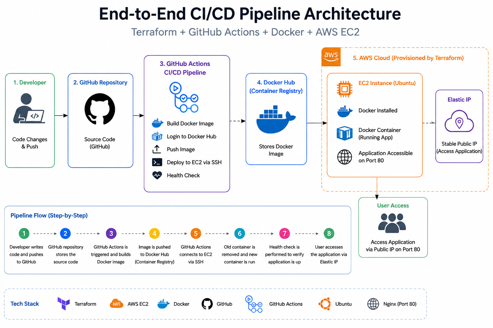

# 🚀 End-to-End CI/CD Pipeline using AWS, Terraform, Docker & GitHub Actions

## 📌 Overview

This project demonstrates a complete end-to-end CI/CD pipeline for a containerized application.

When code is pushed to GitHub, GitHub Actions automatically builds a Docker image, pushes it to Docker Hub, and deploys it to an AWS EC2 instance provisioned using Terraform.

The deployment includes automated health checks to ensure successful application deployment.

---

## 🏗️ Architecture



Developer → GitHub → GitHub Actions → Docker Hub → AWS EC2 → Application

---

## 🧰 Tech Stack

* AWS (EC2, IAM)
* Terraform (Infrastructure as Code)
* Docker
* GitHub Actions
* Linux (Ubuntu)

---

## ⚙️ CI/CD Workflow

1. Developer pushes code to GitHub
2. GitHub Actions pipeline is triggered
3. Docker image is built
4. Docker image is pushed to Docker Hub
5. GitHub Actions connects to AWS EC2 via SSH
6. Existing container is stopped and removed
7. New Docker container is deployed
8. Health check is performed using curl

---

## 🛠️ Setup Instructions

### 1️⃣ Clone Repository

```bash
git clone https://github.com/anjali-devops/ci-cd-demo.git
cd ci-cd-demo
```

---

### 2️⃣ Provision Infrastructure using Terraform

```bash
cd terraform-ec2
terraform init
terraform plan
terraform apply
```

---

### 3️⃣ Configure GitHub Secrets

Go to:

Settings → Secrets → Actions

Add the following secrets:

* DOCKER_USERNAME
* DOCKER_PASSWORD
* EC2_HOST
* EC2_SSH_KEY

---

### 4️⃣ Trigger CI/CD Pipeline

```bash
git add .
git commit -m "trigger pipeline"
git push origin main
```

---

## 🔑 Key Features

* Infrastructure as Code using Terraform
* Automated CI/CD pipeline using GitHub Actions
* Dockerized application deployment
* Automated EC2 deployment using SSH
* Health check validation after deployment
* Elastic IP based stable deployment endpoint
* Reproducible infrastructure lifecycle using Terraform

---

## 🚀 Terraform Lifecycle Commands

### Initialize Terraform

```bash
terraform init
```

### Validate Configuration

```bash
terraform validate
```

### Review Execution Plan

```bash
terraform plan
```

### Create Infrastructure

```bash
terraform apply
```

### Destroy Infrastructure

```bash
terraform destroy
```

---

## 📂 Project Structure

```text
ci-cd-demo/
│
├── .github/workflows/deploy.yml
├── terraform-ec2/
│   └── main.tf
├── images/
│   └── architecture-diagram.png
├── Dockerfile
├── app.py
├── requirements.txt
└── README.md
```

---

## 🧠 Key Learnings

* Infrastructure provisioning using Terraform
* AWS EC2 and Security Group management
* Docker containerization
* CI/CD automation with GitHub Actions
* SSH-based deployment automation
* Infrastructure reproducibility using Terraform
* Managing deployment stability with Elastic IP

---

## 👩‍💻 Author

Anjali Damisetty

* LinkedIn: [www.linkedin.com/in/anjali-damisetty](http://www.linkedin.com/in/anjali-damisetty)
* GitHub: https://github.com/anjali-devops
